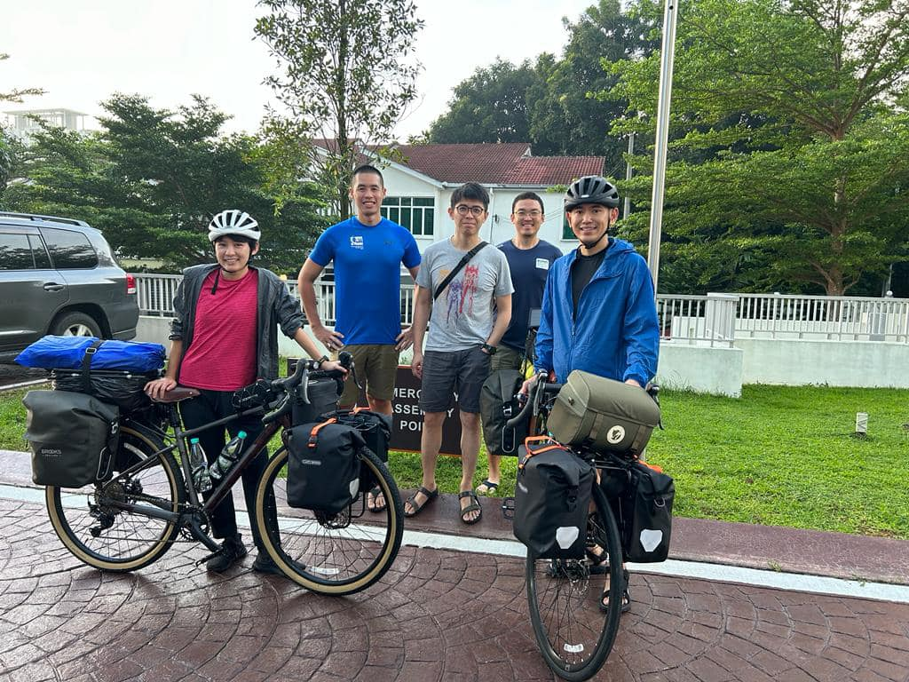

Wake up around 05:30 in the morning, I didn't have enought sleep. But it will never change the fire burning that i will be cycling to denmark today. 

Malcalm, Siong Yuen and King Wai were kind enough to send me off today. 

I was surprised with the recomended route, which will bring you to the road where there are not so many cars. But it doesnt work when I reached rural area because it keeps asking me to go somewhere where I need to risk my life to go across a hustle and bustle road. I give up and use the road that Im familiar with.

Along the way, the cars and lorries went super fast. Some lorries are driven extrame close to me. and it almost hit me.

The road condition, hmm, terrible as usual.

My bike is overloaded. I sometimes cant control over the bike.

My condition, ahh, butt hurts. Heat stroke. I keep drinking water to prevent myself from dehydrated.

Food? I eat whatever i saw. :D

